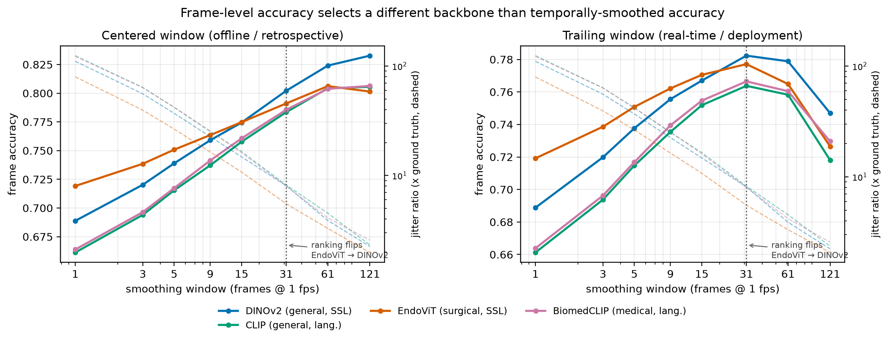

# Frame-Level Accuracy Selects the Wrong Backbone

Temporal evaluation of frozen vision foundation models for surgical video.

**Finding.** Four frozen encoders rank EndoViT > DINOv2 > BiomedCLIP > CLIP under
the standard frame-level probe. Apply the temporal smoothing any deployed
surgical system uses and the ranking inverts: DINOv2 leads and EndoViT falls to
third. The standard metric selects the wrong backbone — under offline *and*
real-time smoothing.

All encoders over-segment surgical phase by 80–124× at 0.66–0.72 frame accuracy.

See [`reports/RESULTS.md`](reports/RESULTS.md) for all tables,
[`reports/report_skeleton.md`](reports/report_skeleton.md) for the write-up,
and [`LEDGER.md`](LEDGER.md) for the failure log.



## Reproduce

```bash
conda create -n endo-vfm python=3.11 -y && conda activate endo-vfm
pip install -r requirements.txt
export BIGDIR=/your/storage HF_HOME=$BIGDIR/hf_cache

python scripts/decode_cholec80.py                    # video -> 1fps frames
python -m src.extract --config configs/dinov2_cholec80.yaml
python -m src.experiments.reproduction_gate --cache ... --frames ...
python -m src.experiments.temporal_smoothing --caches ... --causal
python -m src.experiments.figure_smoothing
```

## Layout
| Path | Purpose |
|---|---|
| `src/encoders/` | One file per model, uniform frozen `Encoder` interface |
| `src/cache/` | Memmap embedding store, SHA256-verified manifests |
| `src/data/` | Loaders and **video-level** splits (never frame-level) |
| `src/metrics/` | Temporal reliability suite + optical-flow coupling |
| `src/experiments/` | Config → results.json, no side effects |
| `tests/` | 12 synthetic controls gating the temporal metrics |

## Method notes
- Splits and bootstrap are **video-level**: frames within a surgery are
  near-duplicates, so frame-level splitting leaks and frame-level bootstrapping
  gives intervals an order of magnitude too tight.
- Drift is **variance-normalized**; raw drift rewards low-variance encoders
  (see `LEDGER.md`, 2026-07-21).
- Smoothing is reported **centered and causal**; only causal is deployable.
